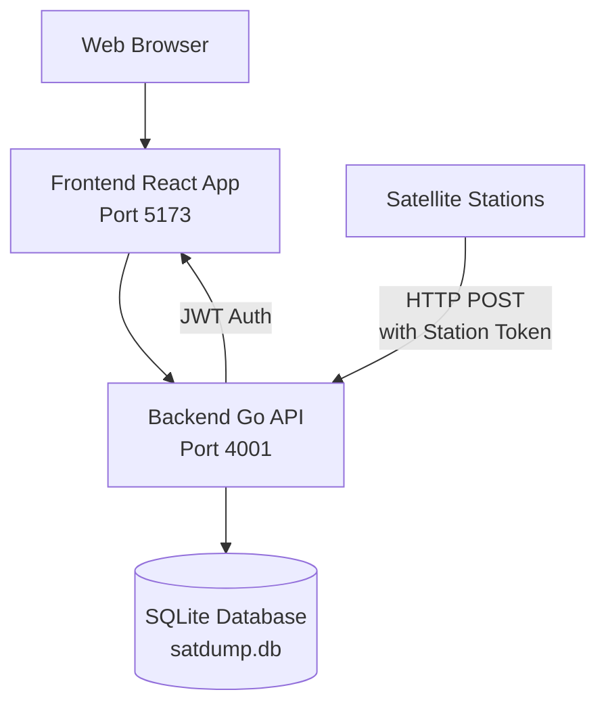

# SatHub

A community platform for satellite enthusiasts to manage ground stations and share captured satellite data.

[](https://github.com/vleeuwenmenno/sathub/actions/workflows/release.yml)
[](https://github.com/vleeuwenmenno/sathub/actions/workflows/build-client.yml)

A web-based platform for managing satellite ground stations and their captured data.

## Features

SatHub provides a comprehensive solution for satellite enthusiasts and operators to manage their ground stations and share satellite data.

### Current Features

- [x] Responsive web interface
- [x] Docker-based development environment
- [x] Database using GORM with SQLite (easily switchable to MariaDB or Postgres)
  - [x] Database seeding for development and testing
- [x] Station management (create, edit, delete ground stations)
  - [x] Station health monitoring
  - [x] Public and private station visibility
  - [x] Satellite data post management
  - [x] Posts upload using API keys per station
  - [x] Global station and user directories
- [x] User authentication and registration
  - [x] JWT-based session management with refresh tokens
  - [x] Password hashing and security best practices
  - [x] Email confirmation for new registrations
  - [x] Password reset via email
  - [x] 2FA Support (TOTP and recovery codes)
- [x] Docker-based production environment
- [x] GitHub Workfows that publish and compile docker images for prod

### Planned Features

- [ ] API rate limiting
- [ ] Data export functionality
- [ ] Achievements for users
- [ ] Notifications (Email, Shoutrr) (e.g. new post from followed station, station offline, etc)
- [ ] Quick access to popular stations

## Tech Stack

### Backend

- **Language**: Go 1.21+
- **Framework**: Gin web framework
- **Database**: PostgreSQL with GORM ORM (SQLite supported for development)
- **Authentication**: JWT tokens with refresh tokens
- **API**: RESTful JSON API

### Frontend

- **Language**: TypeScript
- **Framework**: React 19 with Vite
- **UI Library**: Material-UI (MUI) with Joy design system
- **Routing**: React Router
- **HTTP Client**: Axios

### Development & Deployment

- **Containerization**: Docker & Docker Compose
- **Hot Reloading**: Configured for both frontend and backend
- **Linting**: ESLint for frontend, Go standard tools for backend

## Architecture



## Prerequisites

- Docker and Docker Compose
- Git

For local development without Docker:
- Go 1.21+ (for backend)
- Node.js 18+ and npm (for frontend)

## Quick Start

1. Clone the repository:
   ```bash
   git clone <repository-url>
   cd sathub
   ```

2. Start the development environment:
   ```bash
   docker compose up -d --build
   ```

3. Wait for the backend to compile (first run takes longer).

4. Open your browser to `http://localhost:5173`

5. Seed the database with test data: (If you have the backend running, it will automatically restart due to the database file being changed, so no need to stop/start the backend manually)
   ```bash
   rm backend/satdump.db  
   docker compose exec backend go run main.go --seed
   ```

## Development Setup

### Using Docker (Recommended)

The project includes Docker Compose configuration for easy development:

```bash
# Start all services
docker compose up -d --build

# View logs
docker compose logs -f

# Stop services
docker compose down
```

### Local Development

#### Backend Setup

```bash
cd backend
go mod download
go run main.go
```

The backend will start on `http://localhost:4001`

#### Frontend Setup

```bash
cd frontend
npm install
npm run dev
```

The frontend will start on `http://localhost:5173`

### Database Seeding

To populate the database with test data:

```bash
cd backend && go run main.go --seed
```

*Make sure you don't already have a database file, otherwise the seeding will likely fail!*

This creates:
- 3 test users (alice_skywatcher, bob_satellite, charlie_space)
- 6 stations (mix of public/private)
- 15-40 posts with sample satellite data
- Placeholder images (assuming you have some stored in the root folder data/)

Login with any user using password: `password123`

## API Overview

The backend provides a REST API with the following main endpoints:

### Authentication
- `POST /api/auth/register` - User registration
- `POST /api/auth/login` - User login
- `POST /api/auth/refresh` - Refresh access tokens

### Stations
- `GET /api/stations` - List user's stations
- `POST /api/stations` - Create new station
- `GET /api/stations/:id` - Get station details
- `PUT /api/stations/:id` - Update station
- `DELETE /api/stations/:id` - Delete station
- `GET /api/stations/global` - Global station directory

### Posts
- `GET /api/posts` - List posts (authenticated)
- `GET /api/posts/latest` - Latest posts (public)
- `POST /api/posts` - Create post (station token auth)
- `GET /api/posts/:id` - Get post details

### Users
- `GET /api/users/global` - Global user directory

All endpoints return JSON responses. See `backend/main.go` for complete route definitions.

## Contributing

1. Fork the repository
2. Create a feature branch
3. Make your changes
4. Add tests if applicable
5. Submit a pull request

### Development Guidelines

- Follow Go and TypeScript best practices
- Use meaningful commit messages
- Update documentation for API changes
- Test your changes thoroughly

## Production Images

Production Docker images are automatically built and published to GitHub Container Registry when releases are created:

- Backend: `ghcr.io/vleeuwenmenno/sathub/backend:latest`
- Frontend: `ghcr.io/vleeuwenmenno/sathub/frontend:latest`

Images are tagged with semantic versions (e.g., `v1.0.0`, `v1.0`, `v1`) and `latest`.

## License

This project is licensed under the GNU Affero General Public License v3.0 (AGPL-3.0) - see the [LICENSE](LICENSE) file for details.
