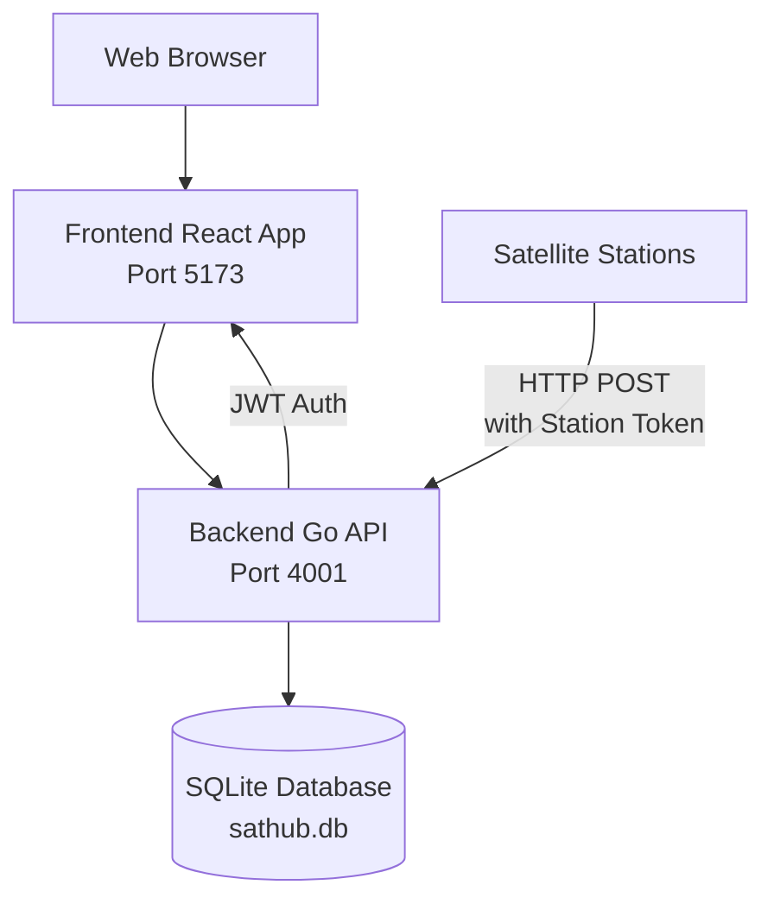

# SatHub - Technical Documentation

This document contains technical details for developers and contributors working on SatHub.

## Tech Stack

### Backend

- **Language**: Go 1.21+
- **Framework**: Gin web framework
- **Database**: PostgreSQL with GORM ORM (SQLite supported for development)
- **Authentication**: JWT tokens with refresh tokens
- **API**: RESTful JSON API

### Frontend

- **Language**: TypeScript
- **Framework**: React 19 with Vite
- **UI Library**: Material-UI (MUI) with Joy design system
- **Routing**: React Router
- **HTTP Client**: Axios

### Development & Deployment

- **Containerization**: Docker & Docker Compose
- **Hot Reloading**: Configured for both frontend and backend
- **Linting**: ESLint for frontend, Go standard tools for backend

## Architecture



## Prerequisites for Development

- Docker and Docker Compose
- Git

For local development without Docker:
- Go 1.21+ (for backend)
- Node.js 18+ and npm (for frontend)

## Development Setup

### Caddy Development Environment (Recommended)

This setup uses Caddy as a reverse proxy to provide proper hostnames for local development, eliminating CORS issues and allowing direct API calls from the frontend.

#### Prerequisites

1. **Add hostnames to your `/etc/hosts` file:**
   ```
   127.0.0.1 sathub.local
   127.0.0.1 api.sathub.local
   127.0.0.1 obj.sathub.local
   ```

2. **Install Docker and Docker Compose**

#### Starting the Development Environment

1. **Start all services:**
   ```bash
   make up
   ```

2. **Access the applications:**
   - **Frontend:** https://sathub.local:9999 (HTTP redirects to HTTPS)
   - **API:** https://api.sathub.local:9999 (HTTP redirects to HTTPS)
   - **MinIO Console:** http://localhost:9001 (admin/minioadmin)

- Note: You likely have to browse to the API URL once and accept the self-signed certificate.

#### Services

- **Caddy** (Ports 9999): Reverse proxy
- **Frontend** (Port 5173): React/Vite development server
- **Backend** (Port 4001): Go API server
- **MinIO** (Port 9000): Object storage server
- **PostgreSQL** (Port 5432): Database
- **Mailpit** (Ports 8025/1025): Email testing

#### Configuration

The `Caddyfile.dev` routes requests to appropriate services:
- `sathub.local` → Frontend
- `api.sathub.local` → Backend API

#### Image Storage

Images are stored in MinIO with organized folder structure:
```
sathub-images/
├── images/
│   ├── post-1/
│   │   ├── image1.jpg
│   │   └── image2.png
│   ├── post-2/
│   │   └── image3.jpg
```

Images are served via the backend API which fetches from MinIO, avoiding CORS issues while maintaining performance.

### Basic Docker Development

If you prefer a simpler setup without Caddy:

```bash
# Start all services
docker compose up -d --build

# View logs
docker compose logs -f

# Stop services
docker compose down
```

### Local Development (Without Docker)

#### Backend Setup

```bash
cd backend
go mod download
go run main.go
```

The backend will start on `http://localhost:4001`

#### Frontend Setup

```bash
cd frontend
npm install
npm run dev
```

The frontend will start on `http://localhost:5173`

### Database Seeding

To populate the database with test data:

```bash
cd backend && go run main.go --seed
```

*Make sure you don't already have a database file, otherwise the seeding will likely fail!*

This creates:
- 3 test users (alice_skywatcher, bob_satellite, charlie_space)
- 6 stations (mix of public/private)
- 15-40 posts with sample satellite data
- Placeholder images (assuming you have some stored in the root folder data/)

Login with any user using password: `password123`

### Troubleshooting

1. **CORS Issues:** Ensure hostnames are added to `/etc/hosts` (Caddy setup)
2. **Image Loading:** Check MinIO console at http://localhost:9001
3. **API Calls Failing:** Verify Caddy is routing correctly
4. **MinIO Connection:** Check logs with `docker-compose logs minio`

## Releases

The project includes a release script to automate the process of creating and publishing new versions.

### Creating a Release

Use the release script to create a new tag and push it to GitHub:

```bash
# Using the script directly
./release.sh

# Or using make
make release
```

The script will:

1. Check for uncommitted changes
2. Get the latest tag
3. Ask you to choose the type of release (patch, minor, or major)
4. Create a new tag with the incremented version
5. Push the tag to GitHub
6. Optionally open the GitHub releases page to create a release

### Version Numbering

The script follows [Semantic Versioning](https://semver.org/):

- **Patch** (1.0.0 → 1.0.1): Bug fixes and small changes
- **Minor** (1.0.0 → 1.1.0): New features that are backward compatible
- **Major** (1.0.0 → 2.0.0): Breaking changes

## API Overview

The backend provides a REST API with the following main endpoints:

### Authentication

- `POST /api/auth/register` - User registration
- `POST /api/auth/login` - User login
- `POST /api/auth/refresh` - Refresh access tokens

### Stations

- `GET /api/stations` - List user's stations
- `POST /api/stations` - Create new station
- `GET /api/stations/:id` - Get station details
- `PUT /api/stations/:id` - Update station
- `DELETE /api/stations/:id` - Delete station
- `GET /api/stations/global` - Global station directory

### Posts

- `GET /api/posts` - List posts (authenticated)
- `GET /api/posts/latest` - Latest posts (public)
- `POST /api/posts` - Create post (station token auth)
- `GET /api/posts/:id` - Get post details

### Users

- `GET /api/users/global` - Global user directory

All endpoints return JSON responses. See `backend/main.go` for complete route definitions.

## Contributing

1. Fork the repository
2. Create a feature branch
3. Make your changes
4. Add tests if applicable
5. Submit a pull request

### Development Guidelines

- Follow Go and TypeScript best practices
- Use meaningful commit messages
- Update documentation for API changes
- Test your changes thoroughly

## Production Images

Production Docker images are automatically built and published to GitHub Container Registry when releases are created:

- Backend: `ghcr.io/vleeuwenmenno/sathub/backend:latest`
- Frontend: `ghcr.io/vleeuwenmenno/sathub/frontend:latest`

Images are tagged with semantic versions (e.g., `v1.0.0`, `v1.0`, `v1`) and `latest`.